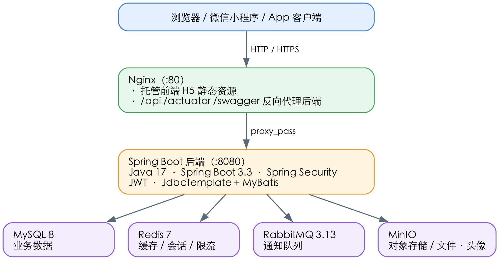

# 校园综合服务平台

校园综合服务平台是在实验室预约管理系统基础上扩展的综合门户项目，面向学生、教师和管理员提供统一登录、实验室预约、通知公告、校园资讯、日程待办、AI 问答、综合服务工作台等功能。

项目包含 uni-app 前端、Spring Boot 后端、MySQL 数据库、Redis 缓存与会话控制、Nginx 静态资源托管与反向代理，并提供 Docker Compose 一键启动环境。

## 功能模块

- 统一登录、注册、修改密码、退出登录。
- 学生、教师综合服务门户。
- 管理员综合服务工作台。
- 实验室预约申请、审核、取消、完成和审批记录。
- 教师注册审核。
- 通知公告、校园资讯、应用中心、我的收藏。
- 日程、待办、门户聚合数据。
- AI 问答：回答前按当前用户角色查询预约、通知、日程、待办等业务上下文。
- Swagger/OpenAPI 接口文档。

## 技术架构



系统整体分为四层：客户端（浏览器 / 微信小程序 / App）经 Nginx 接入，Nginx 托管前端 H5 静态资源并将 `/api`、`/actuator`、`/swagger` 反向代理到 Spring Boot 后端，后端再连接 MySQL、Redis、RabbitMQ、MinIO 等数据与中间件组件。

| 层次 | 技术 |
| --- | --- |
| 前端 | uni-app、Vue、JavaScript、Less |
| 后端 | Java 17、Spring Boot 3.3、Spring Web、Spring Security、JWT |
| 数据库 | MySQL 8 |
| 缓存与会话 | Redis 7 |
| 消息队列 | RabbitMQ |
| 对象存储 | MinIO |
| 数据访问 | JdbcTemplate、MyBatis |
| 接口文档 | springdoc-openapi、Swagger UI |
| 运维监控 | Spring Boot Actuator、Micrometer、Prometheus 指标 |
| AI | OpenAI 兼容 Chat Completions 适配层，支持接入 DeepSeek 等兼容服务 |
| 部署 | Docker、Docker Compose、Nginx |

## 目录结构

```text
origin_uniapp/
├── backend/                 # Spring Boot 后端
│   ├── docs/schema.sql       # 基础表结构和演示数据
│   ├── docs/sql/             # 增量 SQL
│   └── src/
├── deploy/
│   ├── html/                 # Nginx 默认占位页面
│   └── nginx.conf            # Nginx 反向代理与静态资源配置
├── origin_uniapp/            # uni-app 前端工程，使用 HBuilderX 打开
├── .env.example              # Docker Compose 环境变量示例
├── Dockerfile                # 后端镜像构建文件
├── docker-compose.yml        # MySQL、Redis、后端、Nginx 编排
└── README.md
```

## 环境要求

推荐使用 Docker Compose 启动完整环境，首次运行只需要安装：

| 软件 | 用途 |
| --- | --- |
| Docker Desktop | 运行 MySQL、Redis、后端和 Nginx 容器 |
| Docker Compose | 编排项目容器，Docker Desktop 通常已内置 |
| 浏览器 | 访问前端页面和 Swagger UI |

可选安装：

| 软件 | 用途 |
| --- | --- |
| HBuilderX | 开发、运行、构建 uni-app 前端 |
| Java 17 | 本地直接运行后端 |
| Maven 3.9.x | 本地构建和测试后端 |
| MySQL 客户端 | 排查数据库数据 |

Windows 环境下如果 `docker version` 提示无法连接 Docker API，请先启动 Docker Desktop，并确认使用 Linux containers / WSL2 后端。

## 快速启动

进入包含 `docker-compose.yml` 的项目根目录：

```powershell
cd origin_uniapp
```

复制环境变量文件：

```powershell
Copy-Item .env.example .env
```

启动完整环境：

```powershell
docker compose up -d --build
```

首次启动会下载镜像并构建后端，耗时会比后续启动更久。启动完成后查看容器状态：

```powershell
docker compose ps
```

正常情况下会看到以下容器：

```text
campus-mysql
campus-redis
campus-rabbitmq
campus-minio
campus-backend
campus-nginx
```

## 访问地址

| 服务 | 地址 |
| --- | --- |
| Nginx 前端入口 | `http://localhost` |
| 后端接口 | `http://localhost:8080` |
| Swagger UI | `http://localhost/swagger-ui.html` |
| OpenAPI JSON | `http://localhost/v3/api-docs` |
| 服务健康检查 | `http://localhost:8080/api/health` |
| 数据库健康检查 | `http://localhost:8080/api/health/db` |
| Actuator 健康检查 | `http://localhost/actuator/health` |
| Prometheus 指标 | `http://localhost/actuator/prometheus` |
| MinIO API | `http://localhost:9000` |
| MinIO Console | `http://localhost:9001` |
| RabbitMQ AMQP | `localhost:5672` |
| RabbitMQ Management | `http://localhost:15672` |

如果修改了 `.env` 中的端口，请以实际端口为准。

## 默认账号

| 角色 | 账号 | 密码 |
| --- | --- | --- |
| 管理员 | `admin001` | `123123` |
| 教师 | `T20230001` | `123123` |
| 学生 | `S20230001` | `123123` |

登录接口示例：

```powershell
$body = @{ accountNo = 'admin001'; password = '123123'; role = 'admin' } | ConvertTo-Json
Invoke-RestMethod http://localhost/api/auth/login -Method Post -ContentType 'application/json' -Body $body
```

Swagger 调试受保护接口时，先调用 `/api/auth/login` 获取 `accessToken`，再点击 Swagger UI 的 `Authorize`，填写：

```text
Bearer <accessToken>
```

## 前端运行

### HBuilderX 开发运行

1. 打开 HBuilderX。
2. 导入前端工程目录：

```text
origin_uniapp/origin_uniapp
```

3. 确认后端环境已经启动。
4. 在 HBuilderX 中选择“运行 -> 运行到浏览器 -> Chrome”。

前端默认请求后端地址：

```text
http://localhost:8080
```

该配置位于：

```text
origin_uniapp/api/request.js
```

### Nginx 托管正式 H5

HBuilderX 中执行“发行 -> 网站 H5”后，通常会生成：

```text
origin_uniapp/unpackage/dist/build/h5
```

将 `.env` 中的：

```text
NGINX_HTML_DIR=./deploy/html
```

改为：

```text
NGINX_HTML_DIR=./origin_uniapp/unpackage/dist/build/h5
```

重启 Nginx：

```powershell
docker compose up -d --force-recreate nginx
```

之后访问：

```text
http://localhost
```

## 后端本地开发

如果需要在本机直接运行 Spring Boot，可以只用 Docker 启动 MySQL 和 Redis：

```powershell
docker compose up -d mysql redis
```

然后进入后端目录启动：

```powershell
cd backend
mvn spring-boot:run
```

本地默认使用 `dev` profile，读取 `backend/src/main/resources/application-dev.yml`，连接本机暴露的 MySQL 和 Redis。

运行测试：

```powershell
mvn test
```

Docker Compose 启动后端时会设置：

```text
SPRING_PROFILES_ACTIVE=prod
```

并读取 `backend/src/main/resources/application-prod.yml`，数据库、Redis、JWT、AI 等配置通过环境变量注入。

## 环境变量

主要环境变量位于 `.env.example`，首次运行请复制为 `.env` 后按需修改。

| 变量 | 说明 |
| --- | --- |
| `MYSQL_DATABASE` | MySQL 数据库名 |
| `MYSQL_USER` / `MYSQL_PASSWORD` | MySQL 业务账号和密码 |
| `MYSQL_ROOT_PASSWORD` | MySQL root 密码 |
| `SPRING_PROFILES_ACTIVE` | Spring Boot profile，Docker 默认 `prod` |
| `BACKEND_PORT` | 后端映射端口，默认 `8080` |
| `NGINX_PORT` | Nginx 映射端口，默认 `80` |
| `NGINX_HTML_DIR` | Nginx 托管的前端静态资源目录 |
| `REDIS_CACHE_ENABLED` | 是否启用 Redis 缓存 |
| `REDIS_AUTH_SESSION_ENABLED` | 是否启用 Redis JWT 会话校验 |
| `RABBITMQ_AMQP_PORT` / `RABBITMQ_MANAGEMENT_PORT` | RabbitMQ AMQP 和管理后台端口 |
| `RABBITMQ_USERNAME` / `RABBITMQ_PASSWORD` | RabbitMQ 账号和密码 |
| `RABBITMQ_ENABLED` | 是否启用 RabbitMQ 通知队列 |
| `RABBITMQ_NOTIFICATION_EXCHANGE` | 通知消息 exchange |
| `RABBITMQ_NOTIFICATION_QUEUE` | 通知消息 queue |
| `RABBITMQ_NOTIFICATION_ROUTING_KEY` | 通知消息 routing key |
| `RATE_LIMIT_ENABLED` | 是否启用 Redis 接口限流 |
| `RATE_LIMIT_LOGIN_PER_MINUTE` | 登录接口每 IP 每分钟允许请求数 |
| `RATE_LIMIT_REGISTER_PER_FIVE_MINUTES` | 注册接口每 IP 每 5 分钟允许请求数 |
| `RATE_LIMIT_AI_PER_MINUTE` | AI 问答接口每用户或 IP 每分钟允许请求数 |
| `UPLOAD_MAX_FILE_SIZE` / `UPLOAD_MAX_REQUEST_SIZE` | 后端文件上传大小限制 |
| `MINIO_API_PORT` / `MINIO_CONSOLE_PORT` | MinIO API 和控制台端口 |
| `MINIO_ROOT_USER` / `MINIO_ROOT_PASSWORD` | MinIO 管理员账号和密码 |
| `MINIO_ENABLED` | 是否启用对象存储 |
| `MINIO_PUBLIC_ENDPOINT` | MinIO 外部访问地址配置，默认 `http://localhost:9000` |
| `MINIO_BUCKET` | 文件上传使用的 bucket |
| `JWT_SECRET` | JWT 签名密钥，部署时必须替换 |
| `JWT_EXPIRATION_SECONDS` | JWT 有效期 |
| `OPENAPI_ENABLED` / `SWAGGER_UI_ENABLED` | 是否启用接口文档 |
| `MANAGEMENT_ENDPOINTS_WEB_EXPOSURE_INCLUDE` | Actuator 暴露端点，默认 `health,info,prometheus` |
| `MANAGEMENT_HEALTH_SHOW_DETAILS` | Actuator 健康检查详情显示策略，默认 `never` |
| `AI_ENABLED` | 是否启用真实大模型调用 |
| `AI_API_URL` / `AI_API_KEY` / `AI_MODEL` | OpenAI 兼容模型服务配置 |

生产或公开环境中请务必修改默认数据库密码和 `JWT_SECRET`。

## 消息队列

项目已接入 RabbitMQ，用于异步处理站内通知。预约提交、教师审核、管理员终审等业务调用 `NotificationService.send` 后，会在事务提交后发布通知消息，消费者再写入 `notifications` 表。

Docker Compose 启动后可访问 RabbitMQ 管理后台：

```text
http://localhost:15672
```

默认账号密码来自 `.env`：

```text
RABBITMQ_USERNAME=campus
RABBITMQ_PASSWORD=campus_mq_pwd
```

当前通知队列配置：

```text
exchange:    campus.notification.exchange
queue:       campus.notification.queue
routing key: campus.notification.created
```

如果 RabbitMQ 临时不可用，后端会降级为直接写入通知表，避免影响预约和审核主流程。

## 对象存储

项目已接入 MinIO，用于承载头像、资讯封面、通知附件、实验室图片等文件资源。Docker Compose 启动后可访问：

```text
MinIO API:     http://localhost:9000
MinIO Console: http://localhost:9001
```

默认账号密码来自 `.env`：

```text
MINIO_ROOT_USER=minioadmin
MINIO_ROOT_PASSWORD=minioadmin123
```

后端上传接口：

```text
POST /api/storage/files
```

示例：

```powershell
curl.exe -H "Authorization: Bearer <accessToken>" -F "file=@README.md" http://localhost/api/storage/files
```

上传成功后会返回 `objectKey` 和 `url`，读取接口为：

```text
GET /api/storage/files/{objectKey}
```

## 数据库初始化

Docker 首次创建 MySQL 数据卷时，会自动执行以下脚本：

```text
backend/docs/schema.sql
backend/docs/sql/V1__portal_app.sql
backend/docs/sql/V2__notice_news.sql
backend/docs/sql/V3__calendar_ai.sql
backend/docs/sql/V4__init_portal_data.sql
backend/docs/sql/V5__fix_portal_seed_encoding.sql
backend/docs/sql/V6__repair_service.sql
backend/docs/sql/V7__course_schedule_accounts.sql
```

后端启动时也会自动扫描并执行 `backend/docs/sql/*.sql` 中尚未记录的增量脚本，执行记录保存在 `app_schema_migrations` 表。该能力默认开启，可通过 `.env` 中的 `SQL_MIGRATION_ENABLED=false` 关闭。

如果修改了初始化 SQL，但数据库数据卷已经存在，MySQL 不会自动重复执行初始化脚本。需要清空数据卷后重新启动：

```powershell
docker compose down -v
docker compose up -d --build
```

注意：`docker compose down -v` 会删除 MySQL 和 Redis 数据卷。

## Redis 用途

当前 Redis 用于：

| 功能 | 说明 |
| --- | --- |
| 管理员工作台缓存 | 缓存工作台摘要数据，减少重复统计查询 |
| JWT 会话控制 | 登录写入 token 会话，退出登录、改密、禁用账号后可令旧 token 失效 |
| 接口限流 | 对登录、注册、AI 问答等接口做 Redis 计数限流，超过阈值返回 429 |

如需临时关闭 JWT 会话校验，可在 `.env` 中设置：

```text
REDIS_AUTH_SESSION_ENABLED=false
```

如需临时关闭接口限流，可设置：

```text
RATE_LIMIT_ENABLED=false
```

## AI 问答

AI 模块已拆分为 OpenAI 兼容模型适配层。默认不调用真实模型：

```text
AI_ENABLED=false
AI_API_URL=
AI_API_KEY=
AI_MODEL=gpt-3.5-turbo
AI_REQUIRE_API_KEY=true
AI_TIMEOUT_SECONDS=20
```

未配置真实模型时，`/api/ai/chat` 仍会按当前用户角色查询预约、通知、日程、待办等业务上下文，并使用内置规则生成兜底回答。

接入 DeepSeek 或其他 OpenAI 兼容服务时，修改 `.env`：

```text
AI_ENABLED=true
AI_API_URL=<chat/completions 地址>
AI_API_KEY=<密钥>
AI_MODEL=<模型名称>
```

然后重启后端：

```powershell
docker compose up -d --force-recreate backend
```

## MyBatis 使用范围

项目保留 JdbcTemplate，并在复杂查询场景试点 MyBatis：

| Mapper | 用途 |
| --- | --- |
| `AdminDashboardMapper` | 管理员工作台统计 |
| `ReservationMapper` | 预约列表、审批列表、预约详情查询 |
| `AiContextMapper` | AI 回答前的预约、通知、日程、待办上下文查询 |
| `NoticeMapper` | 通知公告门户和管理端查询 |
| `NewsMapper` | 校园资讯分类、列表和详情查询 |

写操作仍主要保留在现有服务中，避免一次性大迁移带来不必要风险。

## 运维监控

后端已接入 Spring Boot Actuator 和 Micrometer Prometheus 指标，默认通过 Nginx 暴露：

```text
http://localhost/actuator/health
http://localhost/actuator/prometheus
```

`/actuator/health` 用于标准健康检查，`/actuator/prometheus` 可被 Prometheus 或兼容监控系统抓取。默认只暴露 `health`、`info`、`prometheus`，避免把过多内部端点直接开放。

## 常用命令

查看容器状态：

```powershell
docker compose ps
```

查看后端日志：

```powershell
docker logs -f campus-backend
```

重新构建并启动后端：

```powershell
docker compose build backend
docker compose up -d --force-recreate backend
```

重启全部服务：

```powershell
docker compose up -d
```

停止服务但保留数据：

```powershell
docker compose down
```

清空数据并重新初始化：

```powershell
docker compose down -v
docker compose up -d --build
```

## 常见问题

### Docker 无法连接 Docker API

先启动 Docker Desktop，等待状态变为 running。Windows 建议使用 Linux containers / WSL2 后端。

### 端口被占用

修改 `.env` 中的端口配置，例如：

```text
NGINX_PORT=8088
BACKEND_PORT=18080
MYSQL_PORT=13306
REDIS_PORT=16379
```

然后重新启动：

```powershell
docker compose up -d
```

### 页面出现中文乱码

优先确认数据库是通过 Docker 初始化脚本导入的。如果曾通过 PowerShell 管道手动导入中文 SQL，可能写入了乱码数据。演示环境可清空数据卷后重新初始化：

```powershell
docker compose down -v
docker compose up -d --build
```

### Swagger 能打开但接口返回 401

先调用 `/api/auth/login` 登录，把返回的 `accessToken` 按 `Bearer <accessToken>` 填入 Swagger UI 的 `Authorize`。

### HBuilderX 前端请求失败

先确认后端健康检查可用：

```text
http://localhost:8080/api/health
```

如果修改了后端端口，需要同步检查前端保存的 API 地址或清理浏览器应用缓存后重新运行。
